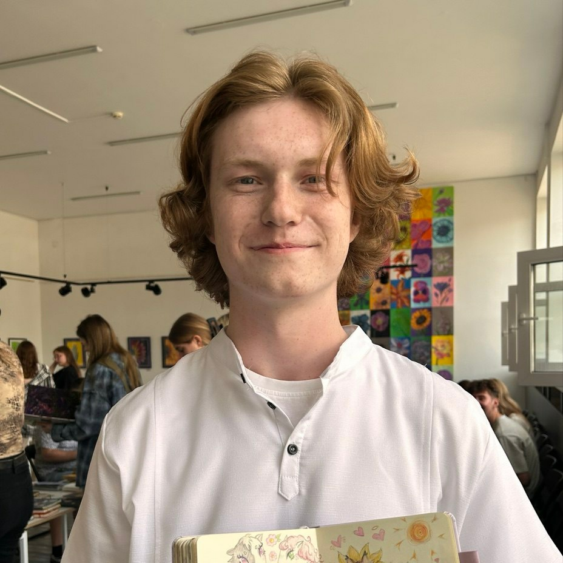

# **Ihar Salahub**

 

## *Contacts*

    Phone:+375292165303
    Discord:anth0cyan
    Telegram:anth0cyan

## About me
22 year old man, currently a Rolling Scopes School student. My goal is to become a web developer and to work on websites and projects associated with web development. 

## Skills
- Working with Git and Github on a basic level
- Know the basics of markdown
- Im a quick learner
- B1 to B2 level of English proficiency (according to [efset.org](https://www.efset.org/ru/quick-check/launch/))
- experienced in working in stress environment
- have experience working with difficult people and clients in general

## Experience
- Seller (2024 - 2025)  
  - A lot of experience working with people and in stressful environment as well as maintaining durability to work for a long time
- Sales floor manager (2025 - 2026)
  - Gained experience managing the work of group of people and skills to carefully and calmly resolve conflicts with clients and within the work team

## Projects and code examples
- [My CV](https://github.com/Anth0cyan/rsschool-cv/blob/gh-pages/cv.md)
- [Codevars kata solved](https://www.codewars.com/kata/50654ddff44f800200000004)

        function multiply(a, b){
          return a * b
        }